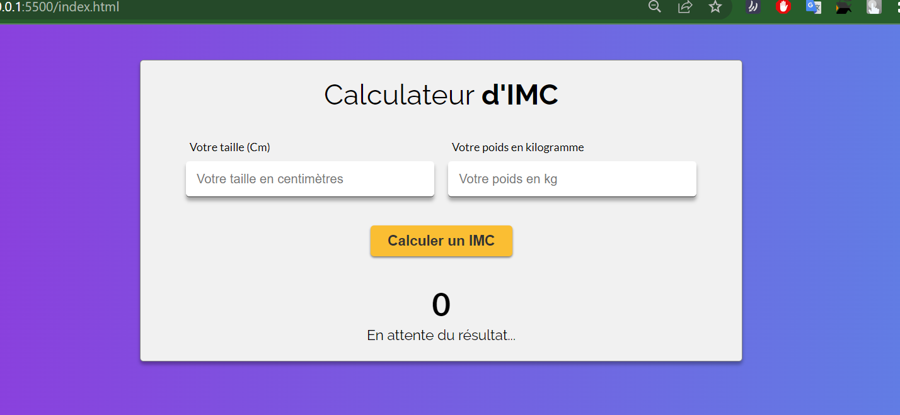

# un calculateur d'IMC

 

Le but de ce projet est de coder un **calculateur d'IMC** à partir des valeurs rentrées par un utilisateur dans les **deux inputs**.

 

### A.une interface basique
1. interface très simple, contenant les éléments importants : boutons, inputs, liens, etc...  
2. un peu de style. 
 
 

### B. Fonctionnalités JavaScript

1. Gestion des inputs.
2. Validation basique, empêchez le calcul si l'utilisateur laisse un ou deux inputs vides.  
Montrez un message pour l'informer de l'erreur.
1. Calcule de l'IMC avec les valeurs rentrées.
2. Calcule du rang de l'IMC par rapport à "IMCData"
3. Remplissage de l'interface en fonction des résultats
   
 

### C. Pour finir avec du style à l'interface.
